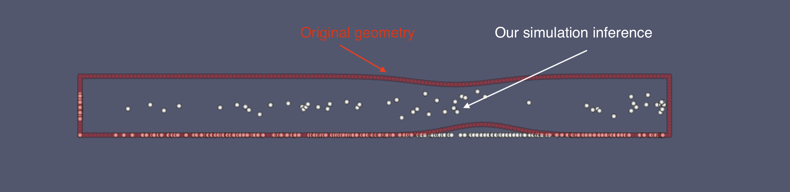
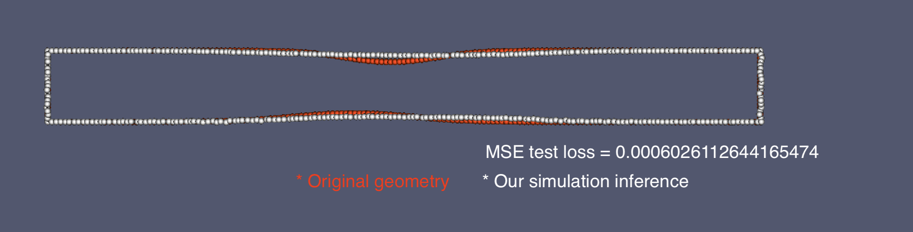
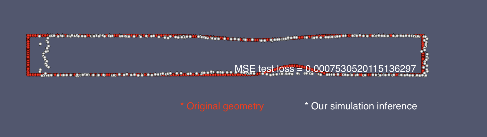

# geometry-parametrization
Uncertainty quantification and surrogate modelling with machine learning methods

In the images below, the **red datapoints** is the original geometry data, while **white ones** are generated.

Autoencoder (data without surface registration):

Autoencoder (data with surface registration):

Convolutional autoencoder (data with surface registration):

Graph neural network (data with surface registration):

