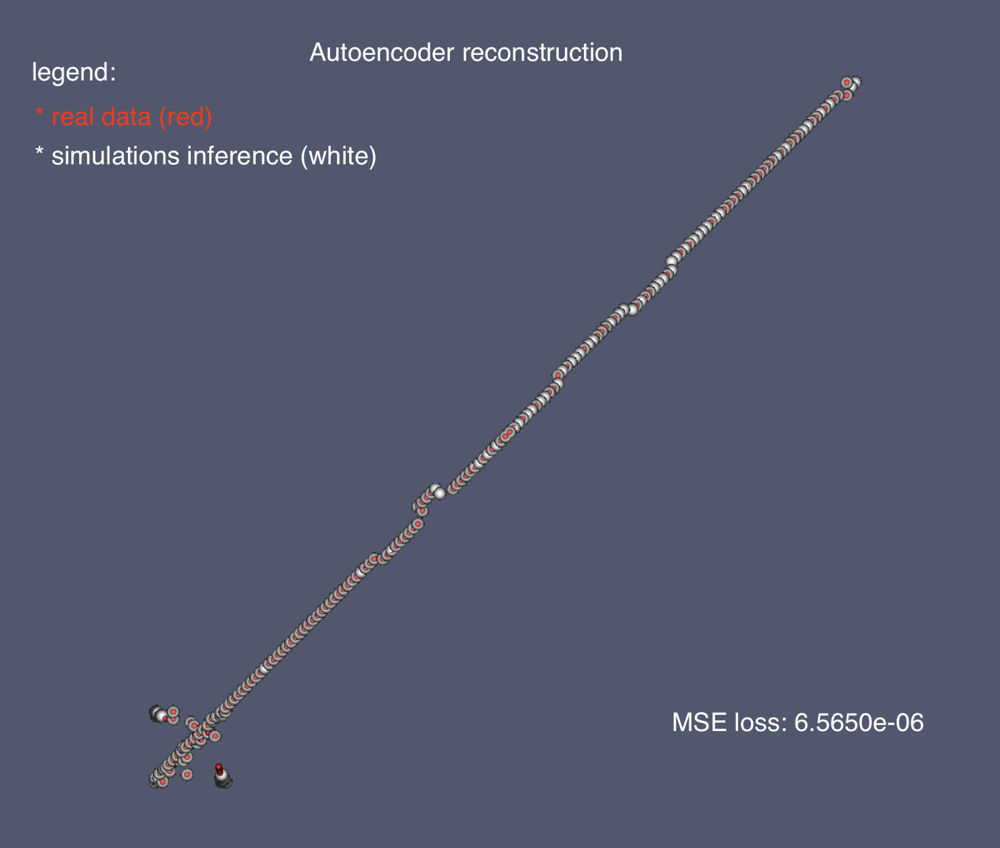
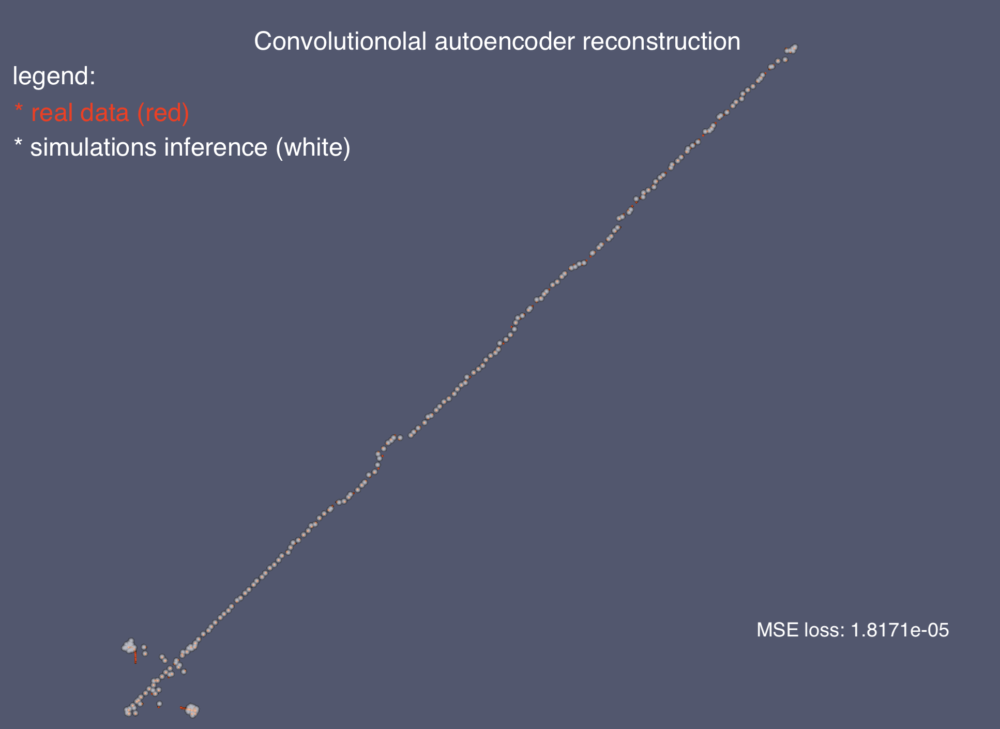

# geometry-parametrization
Uncertainty quantification and surrogate modelling with machine learning methods

Autoencoder (data without surface registration):

Autoencoder (data with surface registration):

Convolutional autoencoder (data with surface registration):
