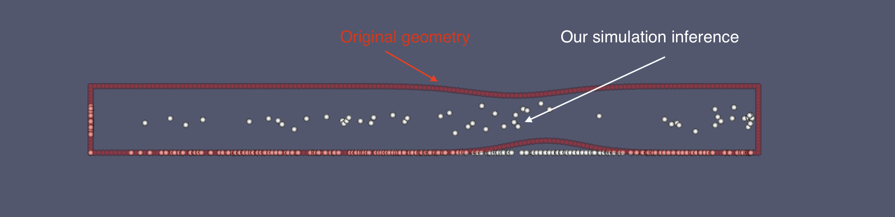
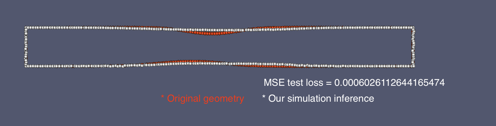
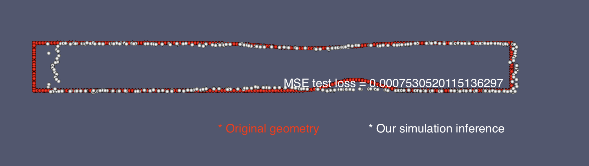
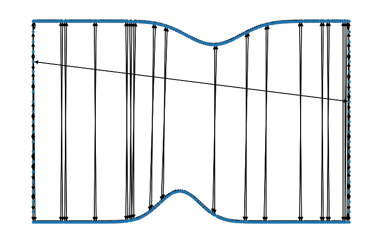
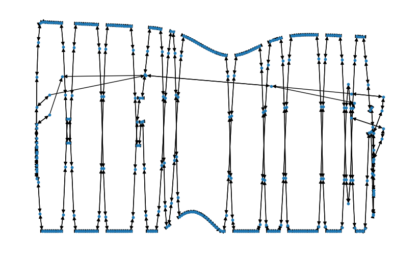
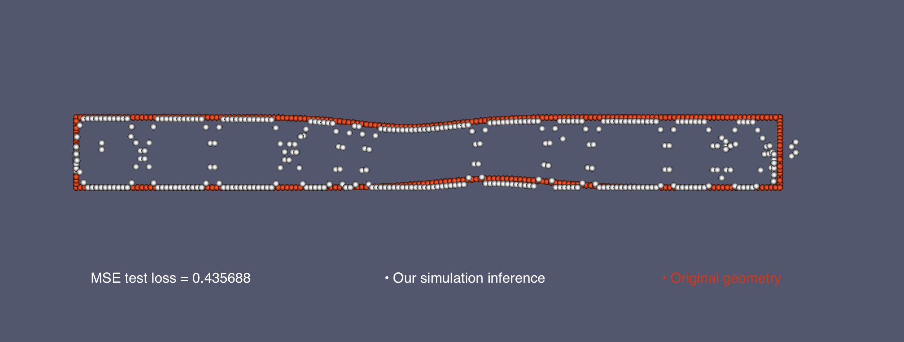

# Geometry parametrization
This repository is a repository to track the work progress on the project "Uncertainty quantification and surrogate modelling with machine learning methods".

**Notice!** In the images below, the **red datapoints** is the original geometry data, while **white** are generated ones.

## Autoencoder (data without surface registration):

## Autoencoder (data with surface registration):

## Convolutional autoencoder (data with surface registration):

## Graph neural network
As for now they performed relatevely bad, because of strange connections between the nodes after registration.\
Original:

Our simulation inference after 1000 epochs of training simple convolutional graph neural network:

In ParaView the result looks the following way: \
